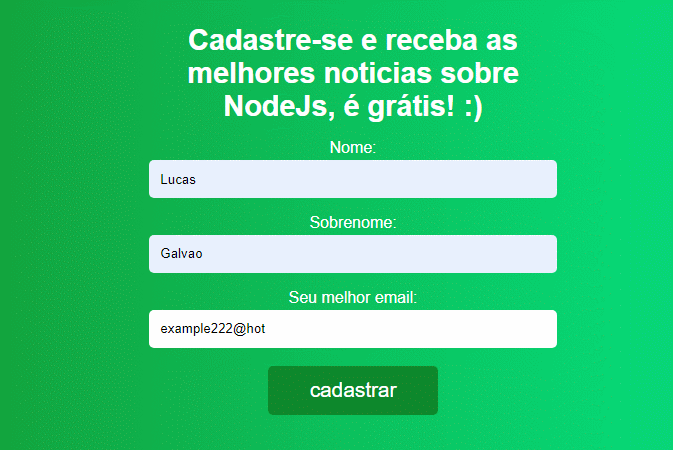
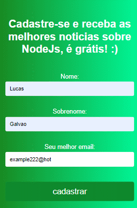

# 📧 NodeNewsLetter 📧
Cadastre-se e receba as melhores notícias sobre NodeJs diretamente no seu e-mail!

O NodeNewsLetter é uma aplicação que envia e-mails automaticamente a cada 24hrs contendo notícias que envolvem o mundo NodeJs.

## ↔ Páginas 100% responsivas ↔

As páginas da aplicação são 100% responsivas e se adaptam a qualquer device.

## Envio de e-mail automatico:

sempre que uma notícia estiver disponível a aplicação se encarregara de enviar os e-mails automaticamente a todos os  usuários cadastrados.

## 💻 Tecnologias usadas 💻

* HTML
 * CSS
 * JavaScript
 * Node.js
 * Mysql
 * Express
 * EJS
